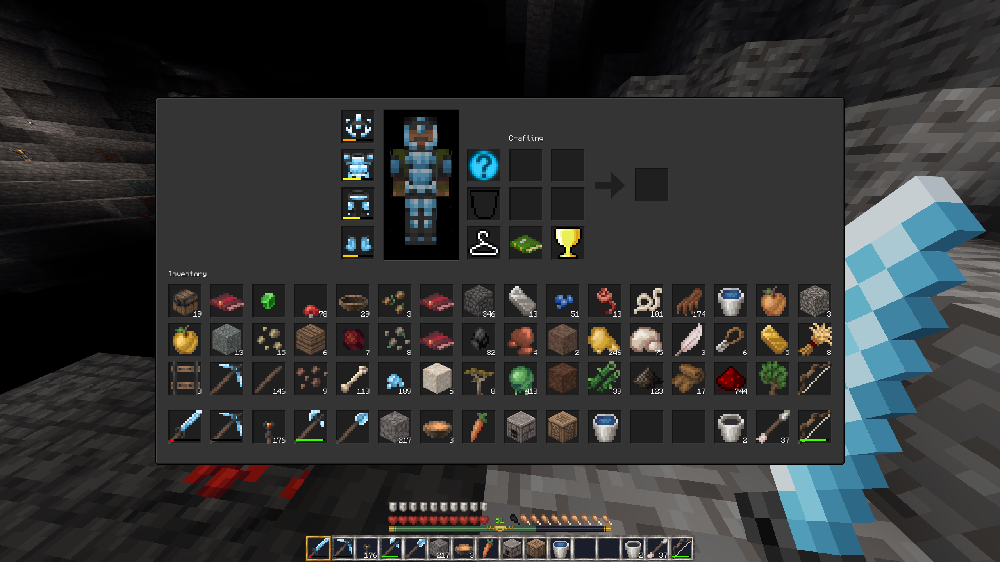
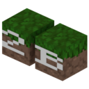

```diff
+ Minimum y is -20618.
+ Maximum stack size is determined by `mcl_stack_max` which is `default_stack_max` or 16384 by default.
+ 64 inventory and 16 hotbar slots
+ dark GUI (based on original graphics by Wuzzy)
+ Node drops are added to the digger's inventory by default (configurable by `mcl_add_drops`).
+ correct creeper speed and explosion timer (1.5 s)
+ Damaged mobs stay red for 0.5 s instead of 1 s.
+ mushroom stew stacking
+ smooth bedrock
+ underground water pools
+ less intrusive HUD burning animation
+ Clouds are at their proper height (layer 192).
+ Players don't stop sprinting after releasing the sprint key.
+ Effect particles are disabled by default (configurable by `mclEffectParticles`).
+ smaller slime group sizes
+ equal mushroom distribution (was mostly red originally)
+ maximum name length at Anvil of 100 characters (was 35)
- sprinting FOV change
- Ender Pearl damage
- pigs
- Christmas and Halloween
- bats
- Zombie Villager
- music
- levelup sound
- achievement sound
- amethyst walking sounds
- some skin customizations
- Totem of Undying
```

### installation
```sh
git clone git@github.com:nnym/mineclone2b ~/.minetest/games/mineclone2b
```





<sub><sup>This icon is based on MineClone2's icon by Wuzzy.</sub></sup>
